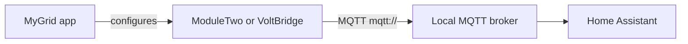
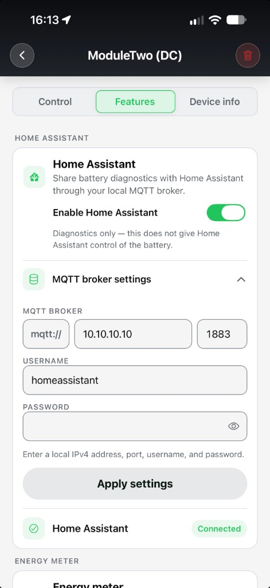
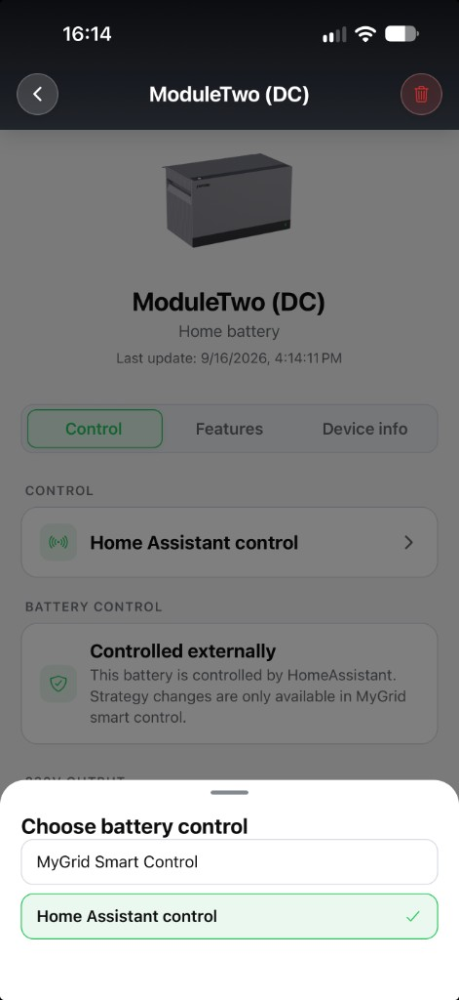

# MyGrid Home Assistant (MQTT)

Local MQTT for [MyGrid](https://www.mygrid.energy) devices. Point the device at the MQTT broker on your home network. Entities appear in Home Assistant via [MQTT Discovery](https://www.home-assistant.io/integrations/mqtt/) — no YAML and no extra add-on beyond a broker.

The app talks to the device. The device talks to your LAN broker. Home Assistant reads that broker. After **Connected**, this path keeps working if the internet is down.

Both products use the same broker fields (**Features → Home Assistant**): `mqtt://` (fixed), local IPv4 address, port (default **1883**), optional username and password. Turn **Enable Home Assistant** on, **Apply settings**. On success the app shows **Connected**.

MyGrid watches [GitHub issues](https://github.com/MyGrid-Energy/mygrid-homeassistant-mqtt/issues). Email [support@mygrid.energy](mailto:support@mygrid.energy).

| Product | What MQTT is for | Docs |
| --- | --- | --- |
| **[MyGrid ModuleTwo](https://www.mygrid.energy/moduletwo)** | Metrics and, after you switch Control in the app, charge/discharge | [docs](moduletwo/) · [setup](moduletwo/setup.md) · [entities](moduletwo/entities.md) · [control](moduletwo/control.md) |
| **[MyGrid VoltBridge](https://www.mygrid.energy)** (P1 meter) | Meter data only | [docs](voltbridge/) · [setup](voltbridge/setup.md) · [entities](voltbridge/entities.md) |

[Energy dashboard](docs/energy-dashboard.md) · [FAQ](docs/faq.md)

## [MyGrid ModuleTwo](https://www.mygrid.energy/moduletwo)

Battery. **Enable Home Assistant** is diagnostics only. After **Connected**, open **Control** and choose battery control:

- **Home Assistant control** — Home Assistant may set charge and discharge power.
- **MyGrid Smart Control** — ModuleTwo runs itself again.

Power and Power Setpoint are in **watts**. **Positive = charging**, **negative = discharging**, **0 = idle**. Default setpoint **−800 W … +1200 W** (discharge up to **−1200 W** on its own breaker). If Home Assistant stops, the last setpoint is held; battery safety still applies.

[ModuleTwo docs](moduletwo/) · [example automations](moduletwo/examples/)

## [MyGrid VoltBridge](https://www.mygrid.energy)

P1 dongle. Same **Features → Home Assistant** MQTT entry. **Connected** is meter data only — no charge/discharge control.

Power is in **kilowatts**, **net** (import minus export): **positive = import**, **negative = export**. Totals (consumption / production, T1/T2) are in **kWh** for the Energy dashboard. Phase voltage/current, gas, and demand appear when the meter sends them. Values update about **once a minute**.

[VoltBridge docs](voltbridge/)

## Nederlands

Lokale MQTT voor [MyGrid](https://www.mygrid.energy/nl)-apparaten. Zelfde velden in de app (**Features → Home Assistant**): `mqtt://`, lokaal IPv4-adres, poort **1883**, optioneel gebruiker/wachtwoord. Zet **Enable Home Assistant** aan, **Apply settings**. Bij succes: **Connected**.

| Product | MQTT |
| --- | --- |
| **[MyGrid ModuleTwo](https://www.mygrid.energy/nl/moduletwo)** | Metingen, en laden/ontladen als je **Home Assistant control** kiest. Vermogen in **W** (**plus = laden**, **min = ontladen**). |
| **[MyGrid VoltBridge](https://www.mygrid.energy/nl)** (P1-meter) | Alleen meterdata. Vermogen in **kW**, netto (**plus = afname**, **min = teruglevering**). Geen sturing. |

[Energy dashboard](docs/energy-dashboard.md) · [FAQ](docs/faq.md) · [support@mygrid.energy](mailto:support@mygrid.energy)
